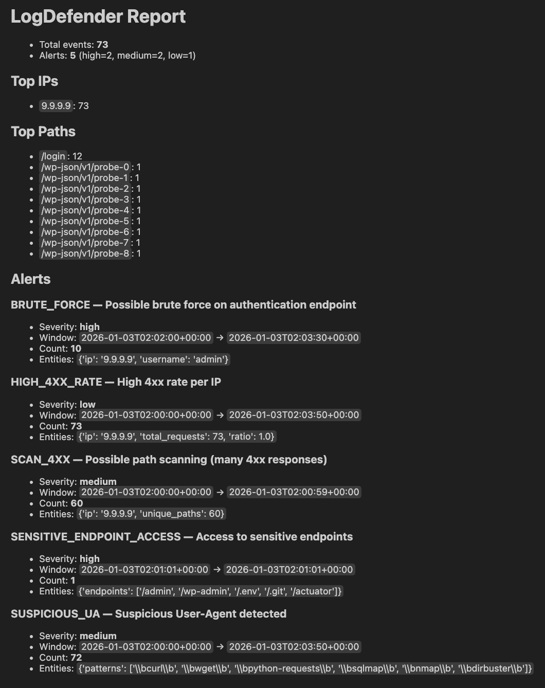

# LogDefender
## SOC/Blue Team Log Triage — Offline Web Access Log Analyzer

LogDefender is an offline analyzer for NGINX-style JSONL access logs. It parses events, runs rule-based detectors, and writes alert/report artifacts to disk.

### Outputs
Written to `--out` (default: `./out`):
- `./out/alerts.json` — structured alerts (JSON) with severity, entities, and evidence.
- `./out/report.md` — a concise Markdown report for quick triage.

### Detection rules
- `BRUTE_FORCE` (auth failures burst)
- `SCAN_4XX` (many 404/403 in a time window)
- `HIGH_4XX_RATE` (high 4xx ratio per IP)
- `SENSITIVE_ENDPOINT_ACCESS` (hits on paths like `/admin`, `/.env`)
- `SUSPICIOUS_UA` (curl/requests/sqlmap-like user agents)

## Quickstart (Docker)
```bash
docker compose up --build
```

## Local usage (Poetry)
If you have Poetry installed locally:

```bash
poetry install
poetry run python -m logdefender analyze samples/nginx_access.sample.jsonl --out out
```

To change the input path/output directory, edit `docker-compose.yml` (`command: [...]`).

---

